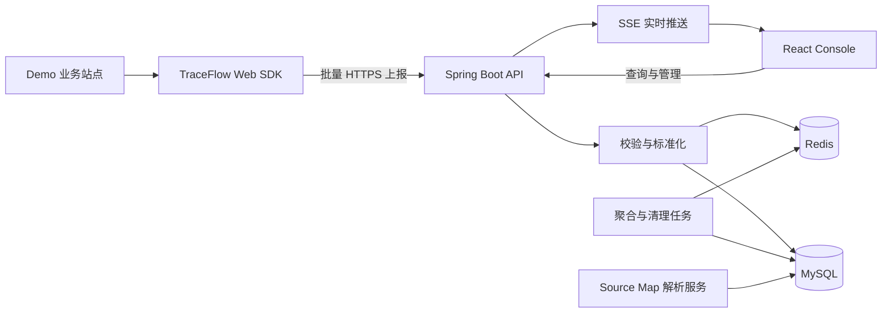
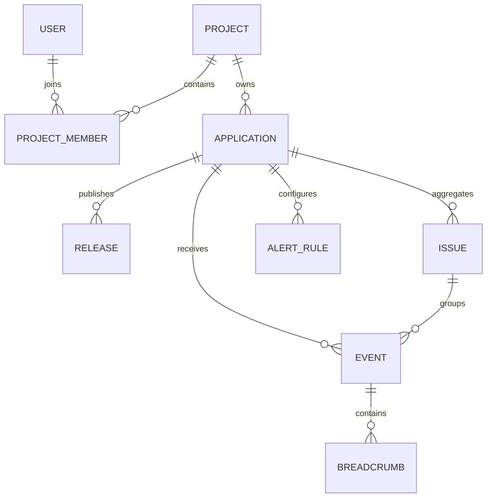

# TraceFlow APM 项目设计

> 面向 Web 应用的前端监控与应用性能管理平台。本文档是项目的范围说明、技术设计和实施路线，后续开发以此为基线。

## 1. 项目定位

### 1.1 项目名称

- 中文名称：TraceFlow 前端监控平台
- 英文名称：TraceFlow APM
- SDK 包名（暂定）：`@traceflow/web-sdk`
- 管理后台名称：TraceFlow Console

`TraceFlow` 表达“从用户行为到异常、请求、性能的一条完整事件链路”。名称简洁，适合在简历、仓库和演示页面中使用。

### 1.2 建设目标

本项目不是只展示静态图表的后台模板，而是一套可以实际运行的前端监控系统：业务页面接入 SDK 后，平台能够采集、上报、存储、聚合并展示真实监控数据，帮助开发者定位线上错误和性能问题。

项目重点体现以下能力：

1. 使用 React 和 TypeScript 构建中大型管理后台。
2. 设计并实现浏览器监控 SDK，理解错误、请求和性能数据的采集原理。
3. 完成从 SDK、服务端、数据库到可视化后台的全链路设计。
4. 处理批量上报、数据聚合、采样、去重、Source Map 等工程问题。
5. 使用 Docker、Nginx 和自动化流程完成可部署、可演示的作品。

### 1.3 目标用户

- 接入 SDK 的前端开发者。
- 查看项目稳定性和性能趋势的研发负责人。
- 根据错误、版本、环境和用户信息排查问题的开发团队。

### 1.4 核心使用场景

1. 开发者创建应用，获得 `appKey`，在业务站点初始化 SDK。
2. 用户访问业务站点时，SDK 自动采集 PV、错误、请求和性能事件。
3. 服务端校验并存储事件，同时生成错误指纹和聚合数据。
4. 开发者在管理后台查看趋势、筛选异常并进入详情页排查。
5. 开发者结合堆栈、面包屑、请求上下文、版本和用户信息定位问题。
6. 后续阶段可上传 Source Map 还原压缩堆栈，并回放错误发生前的用户操作。

## 2. 范围与边界

### 2.1 MVP 必须完成

MVP 的目标是打通一条真实、可演示、可验证的最小监控链路。

- 应用管理：创建应用、生成和查看 `appKey`。
- SDK 初始化与公共上下文采集。
- 页面访问事件（PV）。
- JavaScript 运行时错误采集。
- Promise 未处理异常采集。
- Fetch 和 XMLHttpRequest 请求采集。
- 事件批量上报与页面卸载兜底上报。
- 服务端事件接收、校验和持久化。
- 管理后台登录。
- 总览页：事件量、错误量、错误率、请求成功率、趋势图。
- 错误列表与错误详情。
- 请求列表与请求详情。
- 应用设置与 SDK 接入说明。

### 2.2 第二阶段能力

- Web Vitals：LCP、CLS、INP。
- 页面加载性能与资源加载性能。
- 错误指纹、聚合和首次/最近发生时间。
- 面包屑：路由、点击、请求、控制台异常等上下文。
- 环境、版本、用户维度筛选。
- 错误状态流转：未处理、处理中、已解决、忽略。
- Release 管理。
- Source Map 上传和堆栈还原。
- Redis 缓存与热点聚合。
- SSE 实时事件提示。

### 2.3 第三阶段增强

- 基于 rrweb 的会话回放。
- 采样策略、限流、失败重试和离线缓存。
- 告警规则与通知记录。
- 数据保留与定时清理。
- 多成员和角色权限。
- 更完整的 Docker Compose 与 CI/CD 部署。

### 2.4 暂不实现

以下内容会显著扩大范围，不作为首个可用版本的目标：

- 原生移动端和小程序 SDK。
- 分布式后端链路追踪。
- 自研日志搜索引擎或时序数据库。
- 计费、套餐和商业化功能。
- 复杂组织架构和企业级权限体系。
- 机器学习异常检测。

## 3. 总体架构



### 3.1 数据链路

```text
浏览器产生事件
  -> SDK 插件采集
  -> 补充应用、用户、页面、设备等公共上下文
  -> 内存队列合并
  -> 定时、达到阈值或页面卸载时上报
  -> 服务端鉴权、校验、清洗和计算指纹
  -> 原始事件入库并更新聚合数据
  -> React 后台通过查询接口展示
```

### 3.2 仓库结构

采用单仓库管理，前后端模块保持清晰边界。首版不急于引入复杂的 Monorepo 编排工具，优先使用 npm workspaces；当构建任务明显增多时再评估 Turborepo。

```text
traceflow-apm/
├─ apps/
│  ├─ console/              # React 管理后台
│  └─ demo/                 # 用于制造真实错误与性能数据的演示站点
├─ packages/
│  ├─ web-sdk/              # 浏览器监控 SDK
│  └─ shared/               # 前端项目共享类型与通用常量
├─ server/                  # Spring Boot 服务端
├─ deploy/
│  ├─ nginx/
│  └─ docker/
├─ docs/                    # 架构、协议、部署与面试说明
├─ package.json
└─ README.md
```

说明：Java 服务端不会直接依赖 TypeScript 的共享类型。事件协议以文档/OpenAPI 为契约，两端分别定义并通过接口测试保证一致性。

## 4. 技术选型

### 4.1 React 管理后台

| 领域 | 选型 | 使用理由 |
| --- | --- | --- |
| 构建工具 | Vite | 启动快、配置轻、适合 React + TypeScript |
| UI 框架 | React + TypeScript | 项目的核心学习和简历目标 |
| 路由 | React Router | 路由嵌套、参数路由和鉴权布局成熟 |
| 服务端状态 | TanStack Query | 负责请求、缓存、重试、失效和加载状态 |
| 客户端状态 | Zustand | 存放登录用户、当前应用、界面偏好等少量全局状态 |
| UI 组件 | Ant Design | 管理后台组件完整，表格、筛选和表单效率高 |
| 图表 | ECharts | 适合趋势、占比、分布和 Top N 数据展示 |
| 表单 | React Hook Form + Zod | 表单状态与运行时校验边界清晰 |
| 请求 | Axios | 拦截器、错误规范化和取消请求使用方便 |
| 测试 | Vitest + React Testing Library | 覆盖工具函数、Hooks 和关键交互 |
| 端到端测试 | Playwright | 验证登录、筛选、详情和 SDK 上报链路 |

状态划分原则：

- API 返回的数据属于 TanStack Query，不复制到 Zustand。
- 跨页面且与 UI/身份有关的状态放入 Zustand。
- 仅在组件内部使用的状态保留在 `useState` 或 `useReducer` 中。
- 可由现有状态计算出的值直接派生，不重复存储。

### 4.2 Web SDK

| 领域 | 选型 |
| --- | --- |
| 语言 | TypeScript |
| 构建 | Vite Library Mode |
| 性能指标 | `web-vitals` |
| 单元测试 | Vitest + jsdom |
| 包格式 | ESM 为主，按需要提供 UMD/IIFE 演示构建 |

SDK 需要保持轻量、无 UI 框架依赖，并支持按插件启用功能。业务站点接入 SDK 后，不应因为 SDK 内部异常影响正常页面。

### 4.3 服务端

| 领域 | 选型 |
| --- | --- |
| 语言与框架 | Java + Spring Boot |
| 权限 | Spring Security + JWT |
| 数据访问 | MyBatis Plus |
| 数据库 | MySQL |
| 缓存 | Redis，第二阶段引入 |
| 接口文档 | OpenAPI / Swagger |
| 实时通信 | SSE |
| 数据库迁移 | Flyway |
| 测试 | JUnit + Testcontainers |

首版服务端采用模块化单体，不拆微服务。采集接口和查询接口在代码中分模块，以便以后单独扩容采集入口。

## 5. 领域模型

### 5.1 核心实体关系



首个版本将 `project` 和 `application` 合并，只保留 `application`。当需要表达“一个项目包含 Web、管理后台等多个应用”时，再通过新迁移引入 `project` 层级，不在首迁移预留暂时没有语义的外键。

### 5.2 事件分类

| `type` | 含义 | 典型字段 |
| --- | --- | --- |
| `page_view` | 页面访问 | URL、referrer、route、duration |
| `error` | JS/Promise/资源错误 | message、stack、errorType、fingerprint |
| `http` | Fetch/XHR 请求 | method、url、status、duration、success |
| `performance` | 页面与 Web Vitals | metricName、value、rating |
| `resource` | 静态资源性能/失败 | initiatorType、name、duration、size |
| `custom` | 业务自定义事件 | name、properties |
| `replay` | 会话回放分片 | sessionId、segmentIndex、payload |

MVP 只强制实现 `page_view`、`error` 和 `http`。

## 6. SDK 设计

### 6.1 初始化 API

预期接入方式如下，最终实现时可根据构建产物微调：

```ts
import { init } from '@traceflow/web-sdk';

const traceFlow = init({
  appKey: 'demo-web',
  endpoint: 'https://api.traceflow.example.com/api/v1/events/batch',
  environment: 'production',
  release: 'demo-web@1.0.0',
  sampleRate: 1,
  debug: false,
});

traceFlow.setUser({ id: 'user-1001' });
```

### 6.2 SDK 模块

```text
src/
├─ core/
│  ├─ client.ts             # 初始化、插件注册、生命周期
│  ├─ config.ts             # 配置合并与校验
│  ├─ context.ts            # 公共上下文
│  ├─ queue.ts              # 事件队列
│  └─ transport.ts          # fetch / sendBeacon 上报
├─ plugins/
│  ├─ error.ts              # window error
│  ├─ rejection.ts          # unhandledrejection
│  ├─ http.ts               # fetch / XHR
│  ├─ page-view.ts          # 首次访问与 SPA 路由
│  └─ performance.ts        # 第二阶段
├─ utils/
├─ types/
└─ index.ts
```

### 6.3 公共上下文

每条事件由 SDK 自动补充。传输时 `appKey` 放在批次顶层，服务端解析后将应用 ID 写入每条事件：

- `eventId`：客户端生成的唯一 ID，用于幂等与排查。
- `appKey`：应用标识，在批次顶层传输。
- `timestamp`：事件发生时间，Unix 毫秒。
- `sessionId`：一次浏览会话标识。
- `anonymousId`：匿名浏览器标识，可配置关闭。
- `user`：业务方主动设置的最小用户信息。
- `page`：URL、path、title、referrer。
- `device`：userAgent、language、screen、viewport。
- `environment`：production、staging、development。
- `release`：前端发布版本。
- `sdk`：SDK 名称和版本。
- `traceId`：预留的链路关联标识。

### 6.4 错误采集

MVP 覆盖：

- `window.addEventListener('error', handler, true)`：运行时错误与资源加载错误。
- `window.addEventListener('unhandledrejection', handler)`：未处理 Promise 异常。
- 手动上报 `captureException(error, context?)`。
- SDK 自身逻辑使用隔离的 `try/catch`，避免监控代码影响宿主应用。

错误事件至少包含：

```ts
interface ErrorPayload {
  mechanism: 'onerror' | 'unhandledrejection' | 'resource' | 'manual';
  name: string;
  message: string;
  stack?: string;
  filename?: string;
  lineno?: number;
  colno?: number;
  handled: boolean;
}
```

错误指纹首版由服务端根据 `application + error name + normalized message + top stack frame` 生成。动态 ID、时间戳和 URL 查询参数需要先归一化，避免同类错误被拆成大量 Issue。

### 6.5 请求采集

- 保存原始 `fetch` 和 XHR 方法，包装后保持原始调用语义。
- 记录方法、脱敏 URL、状态码、耗时、请求类型和失败原因。
- 默认不采集请求体、响应体、Authorization、Cookie 等敏感信息。
- 忽略 SDK 自己的上报地址，防止递归采集。
- 允许通过 `denyUrls`、`allowUrls` 和 `beforeSend` 调整采集结果。
- `AbortError` 与普通网络错误分别标记。

### 6.6 SPA 路由采集

- 首次加载记录一次 PV。
- 监听 `popstate`。
- 包装 `history.pushState` 和 `history.replaceState` 后派发内部路由变化事件。
- 对短时间内相同 URL 的重复事件做去重。

SDK 不直接依赖 React Router 或 Vue Router，因此可接入不同框架项目。

### 6.7 队列与上报

- 普通事件先进入内存队列。
- 达到 `batchSize` 或经过 `flushInterval` 后批量上报。
- `visibilitychange`/`pagehide` 时优先使用 `navigator.sendBeacon`。
- Beacon 不可用或负载过大时回退到 `fetch(..., { keepalive: true })`。
- 上报失败按次数进行指数退避重试，并设置最大队列长度。
- 为每批数据设置 `batchId`，服务端配合 `eventId` 进行幂等处理。
- 通过 `beforeSend` 返回 `null` 丢弃敏感或无效事件。

MVP 可先实现内存队列和有限重试；离线 IndexedDB 缓存放到增强阶段。

### 6.8 SDK 配置

```ts
interface TraceFlowOptions {
  appKey: string;
  endpoint: string;
  environment?: string;
  release?: string;
  sampleRate?: number;
  batchSize?: number;
  flushInterval?: number;
  maxQueueSize?: number;
  enableError?: boolean;
  enableHttp?: boolean;
  enablePerformance?: boolean;
  enablePageView?: boolean;
  allowUrls?: Array<string | RegExp>;
  denyUrls?: Array<string | RegExp>;
  beforeSend?: (event: TraceEvent) => TraceEvent | null;
  debug?: boolean;
}
```

## 7. 事件协议

### 7.1 批量上报请求

`POST /api/v1/events/batch`

```json
{
  "schemaVersion": 1,
  "batchId": "f7cd2f44-4266-45f7-a3ee-a061806f9c54",
  "appKey": "demo-web",
  "sentAt": 1760000000000,
  "sdk": {
    "name": "@traceflow/web-sdk",
    "version": "0.1.0"
  },
  "events": [
    {
      "eventId": "58fcf769-d55a-4df5-b0b9-733f87f35f98",
      "type": "error",
      "timestamp": 1760000000000,
      "sessionId": "session-001",
      "environment": "production",
      "release": "demo-web@1.0.0",
      "page": {
        "url": "https://demo.example.com/orders/1001",
        "path": "/orders/1001",
        "title": "Order Detail",
        "referrer": "https://demo.example.com/orders"
      },
      "user": {
        "id": "user-1001"
      },
      "payload": {
        "mechanism": "onerror",
        "name": "TypeError",
        "message": "Cannot read properties of undefined",
        "stack": "TypeError: Cannot read...",
        "filename": "https://demo.example.com/assets/index.js",
        "lineno": 120,
        "colno": 18,
        "handled": false
      },
      "breadcrumbs": []
    }
  ]
}
```

### 7.2 上报响应

采集接口保持响应简单，避免把后台业务结构耦合进 SDK：

```json
{
  "accepted": 1,
  "rejected": 0,
  "requestId": "req-01J8TF6A"
}
```

部分事件失败时返回拒绝数量和有限的错误码，不回显原始敏感数据。

### 7.3 协议演进

- 请求中增加 `schemaVersion`，首版为 `1`。
- 新增可选字段保持向后兼容。
- 删除、重命名或改变字段语义时升级主版本。
- SDK 和服务端分别对协议对象做运行时校验。

## 8. 服务端设计

### 8.1 模块划分

```text
server/src/main/java/.../traceflow/
├─ auth/                    # 登录、JWT、用户
├─ application/             # 应用与 appKey
├─ ingestion/               # 事件接收、校验、标准化
├─ event/                   # 原始事件查询
├─ issue/                   # 错误聚合与状态管理
├─ dashboard/               # 总览聚合查询
├─ release/                 # 发布版本与 Source Map
├─ alert/                   # 后续告警能力
├─ infrastructure/          # 数据库、缓存、存储适配
└─ common/                  # 响应、异常、分页、审计
```

### 8.2 接口约定

- 管理接口前缀：`/api/v1`。
- 采集接口通过 `appKey` 识别应用，并校验 Origin 白名单。
- 管理接口通过 JWT 认证。
- 列表统一使用 `page`、`pageSize`，响应包含 `items` 和 `total`。
- 时间统一以 UTC 存储，接口使用 ISO 8601；前端按用户时区展示。
- 错误响应统一包含 `code`、`message`、`requestId`。

### 8.3 主要接口

| 方法 | 路径 | 说明 | 阶段 |
| --- | --- | --- | --- |
| `POST` | `/api/v1/auth/login` | 登录 | MVP |
| `GET` | `/api/v1/auth/me` | 当前用户 | MVP |
| `GET` | `/api/v1/applications` | 应用列表 | MVP |
| `POST` | `/api/v1/applications` | 创建应用 | MVP |
| `GET` | `/api/v1/applications/{id}` | 应用详情 | MVP |
| `PATCH` | `/api/v1/applications/{id}` | 修改应用配置 | MVP |
| `POST` | `/api/v1/events/batch` | SDK 批量上报 | MVP |
| `GET` | `/api/v1/dashboard/overview` | 核心指标 | MVP |
| `GET` | `/api/v1/dashboard/trends` | 趋势数据 | MVP |
| `GET` | `/api/v1/issues` | 错误聚合列表 | MVP |
| `GET` | `/api/v1/issues/{id}` | 错误详情 | MVP |
| `PATCH` | `/api/v1/issues/{id}/status` | 修改处理状态 | 第二阶段 |
| `GET` | `/api/v1/issues/{id}/events` | 同类错误事件 | MVP |
| `GET` | `/api/v1/http-events` | 请求事件列表 | MVP |
| `GET` | `/api/v1/http-events/{id}` | 请求事件详情 | MVP |
| `GET` | `/api/v1/performance` | 性能指标 | 第二阶段 |
| `POST` | `/api/v1/releases` | 创建发布版本 | 第二阶段 |
| `POST` | `/api/v1/releases/{id}/source-maps` | 上传 Source Map | 第二阶段 |
| `GET` | `/api/v1/stream` | SSE 实时通知 | 第二阶段 |

### 8.4 数据处理流程

1. 根据 `appKey` 查询应用并校验状态、Origin 和请求大小。
2. 校验 `schemaVersion`、事件类型、时间和必填字段。
3. 清理超长字段，过滤敏感 Header 和 URL 参数。
4. 使用 `eventId` 做幂等检查。
5. 对错误事件生成 fingerprint，并新增或更新 Issue。
6. 原始事件批量写入数据库。
7. 更新按分钟/小时的聚合指标。
8. 第二阶段通过 SSE 通知当前应用出现新错误。

在 MVP 数据量下可以同步完成 1-6；聚合更新和 Source Map 解析随后改为异步任务。设计上保留事件处理器接口，避免未来重写采集控制器。

## 9. 数据库设计

### 9.1 `users`

| 字段 | 类型 | 说明 |
| --- | --- | --- |
| `id` | bigint | 主键 |
| `email` | varchar(191) | 登录邮箱，唯一索引 |
| `password_hash` | varchar(255) | 密码哈希 |
| `display_name` | varchar(100) | 显示名称 |
| `status` | varchar(20) | active/disabled |
| `created_at` | datetime(3) | 创建时间 |
| `updated_at` | datetime(3) | 更新时间 |

### 9.2 `applications`

| 字段 | 类型 | 说明 |
| --- | --- | --- |
| `id` | bigint | 主键 |
| `name` | varchar(100) | 应用名称 |
| `app_key` | varchar(64) | SDK 应用标识，唯一索引 |
| `platform` | varchar(20) | web |
| `allowed_origins` | json | 上报来源白名单 |
| `retention_days` | int | 数据保留天数 |
| `status` | varchar(20) | active/disabled |
| `created_by` | bigint | 创建用户 |
| `created_at` | datetime(3) | 创建时间 |
| `updated_at` | datetime(3) | 更新时间 |

### 9.3 `events`

MVP 使用一张通用事件表快速打通链路。高频筛选字段独立成列，差异较大的事件内容放在 JSON 中。

| 字段 | 类型 | 说明 |
| --- | --- | --- |
| `id` | bigint | 主键 |
| `event_id` | varchar(36) | 客户端事件 ID |
| `application_id` | bigint | 应用 ID |
| `issue_id` | bigint nullable | 所属错误 Issue |
| `type` | varchar(30) | 事件类型 |
| `occurred_at` | datetime(3) | 事件发生时间 |
| `received_at` | datetime(3) | 服务端接收时间 |
| `environment` | varchar(40) | 环境 |
| `release_name` | varchar(100) nullable | 发布版本 |
| `session_id` | varchar(64) nullable | 会话 ID |
| `user_id` | varchar(100) nullable | 业务用户标识 |
| `page_url` | varchar(2048) | 页面 URL |
| `payload` | json | 事件主体 |
| `context` | json | 设备、页面、SDK 等上下文 |
| `breadcrumbs` | json nullable | 面包屑 |

关键索引：

- 唯一索引：`(application_id, event_id)`。
- 列表索引：`(application_id, type, occurred_at)`。
- 版本查询：`(application_id, release_name, occurred_at)`。
- 用户查询：`(application_id, user_id, occurred_at)`。
- Issue 查询：`(issue_id, occurred_at)`。

说明：MySQL JSON 字段适合项目初期和作品演示，但不把所有条件都塞进 JSON。后续出现明确的查询热点后，再拆分 `http_events`、`performance_events` 或引入分析型存储，不做无数据依据的提前优化。

### 9.4 `issues`

| 字段 | 类型 | 说明 |
| --- | --- | --- |
| `id` | bigint | 主键 |
| `application_id` | bigint | 应用 ID |
| `fingerprint` | varchar(64) | 归一化错误指纹 |
| `title` | varchar(500) | 错误摘要 |
| `error_type` | varchar(100) | TypeError 等 |
| `status` | varchar(20) | unresolved/resolving/resolved/ignored |
| `level` | varchar(20) | error/warning |
| `first_seen_at` | datetime(3) | 首次出现 |
| `last_seen_at` | datetime(3) | 最近出现 |
| `event_count` | bigint | 总次数 |
| `affected_user_count` | bigint | 影响用户数 |
| `latest_event_id` | bigint | 最新事件 |
| `created_at` | datetime(3) | 创建时间 |
| `updated_at` | datetime(3) | 更新时间 |

唯一索引：`(application_id, fingerprint)`。

### 9.5 `metric_buckets`

用于总览和趋势查询，避免每次扫描原始事件。

| 字段 | 类型 | 说明 |
| --- | --- | --- |
| `id` | bigint | 主键 |
| `application_id` | bigint | 应用 ID |
| `bucket_time` | datetime | 分钟或小时起点 |
| `granularity` | varchar(10) | minute/hour/day |
| `metric_name` | varchar(50) | error_count、pv_count 等 |
| `dimension` | json nullable | environment、release 等维度 |
| `metric_value` | decimal(20,4) | 指标值 |

唯一索引需要包含应用、桶时间、粒度、指标名和稳定的维度哈希；不要直接依赖 JSON 文本顺序判重。

### 9.6 其他阶段性表

- `releases`：应用版本、部署时间、commit SHA。
- `source_maps`：版本、文件名、存储路径、上传状态。
- `alert_rules`：条件、阈值、窗口、通知方式。
- `alert_histories`：触发时间和结果。
- `replay_segments`：会话回放分片元数据，正文优先放对象存储。

## 10. React 管理后台设计

### 10.1 页面结构

```text
/login
/apps
/apps/:appId/overview
/apps/:appId/issues
/apps/:appId/issues/:issueId
/apps/:appId/network
/apps/:appId/performance       # 第二阶段
/apps/:appId/sessions          # 第三阶段
/apps/:appId/releases          # 第二阶段
/apps/:appId/settings
```

### 10.2 页面职责

#### 登录页

- 邮箱和密码登录。
- 表单校验、登录失败反馈、提交状态。
- 已登录用户访问时跳转到应用列表或上次使用的应用。

#### 应用列表

- 展示应用名称、平台、近 24 小时错误量和最后上报时间。
- 创建应用并生成 `appKey`。
- 空状态提供明确的创建入口。

#### Overview

- 时间范围和环境筛选器。
- 错误事件数、受影响用户数、PV、请求成功率等核心指标。
- 错误与流量趋势。
- Top Issues、慢请求、版本分布。
- 第二阶段加入 Web Vitals 分布。

#### Issues

- 支持关键词、状态、环境、版本、时间范围筛选。
- 列展示错误标题、类型、发生次数、影响用户、首次/最近发生时间。
- URL 查询参数保存筛选条件，刷新和分享链接后仍可还原。
- 支持分页、排序、空状态和请求失败重试。

#### Issue Detail

- 错误标题、状态、环境、版本和统计信息。
- 原始与 Source Map 还原后的堆栈。
- 单次事件切换。
- 用户、页面、浏览器、设备上下文。
- 面包屑时间线。
- 相邻网络请求。
- 第三阶段加入“查看会话回放”。

#### Network

- 请求方法、URL、状态码、耗时、发生时间。
- 状态、耗时区间、关键字筛选。
- 慢请求排行、失败率趋势。
- 详情中展示经过脱敏的请求上下文。

#### Settings

- 应用名称、允许的 Origin、数据保留时间。
- SDK 初始化代码片段。
- 数据采集开关和采样比例。
- 删除或禁用应用等危险操作放在独立区域并二次确认。

### 10.3 前端目录建议

```text
apps/console/src/
├─ app/
│  ├─ router.tsx
│  ├─ providers.tsx
│  └─ query-client.ts
├─ layouts/
├─ pages/
│  ├─ login/
│  ├─ applications/
│  ├─ overview/
│  ├─ issues/
│  ├─ network/
│  └─ settings/
├─ features/
│  ├─ auth/
│  ├─ application-switcher/
│  ├─ issue-filters/
│  └─ time-range/
├─ components/
├─ hooks/
├─ api/
├─ stores/
├─ types/
├─ utils/
└─ styles/
```

组件划分遵循“页面负责编排，Feature 封装业务交互，通用组件不感知领域”的原则。不要为了追求目录形式把只有一个使用点的组件过早抽象。

### 10.4 查询与状态示例

- `useIssues(filters)`：由 TanStack Query 管理请求与缓存，`filters` 进入 query key。
- `useIssue(issueId)`：详情数据单独缓存。
- `useCurrentApplicationStore`：保存当前应用 ID 和最近选择。
- `useAuthStore`：只保存必要的身份状态，不在持久化存储中保存敏感用户信息。
- 筛选条件优先存 URL search params，便于刷新和分享。

### 10.5 交互与视觉原则

- 面向研发人员，界面应紧凑、克制、便于扫描。
- 主要布局由侧边导航、顶部应用/时间筛选和内容区域组成。
- 详情信息使用分区和标签页，不堆叠大量装饰性卡片。
- 所有异步页面都具备 loading、empty、error、success 四类状态。
- 错误级别、HTTP 状态和性能评级不只依赖颜色表达。
- 表格列宽、堆栈、URL 和长错误信息需要合理截断并支持复制/展开。
- 桌面端作为主要使用场景，同时保证常见笔记本宽度下可用。

## 11. React 学习与注释约定

本项目既是产品作品，也是从 Vue 转向 React 的实战。代码注释只放在真正存在心智模型差异的位置，不给显而易见的语法逐行加注释。

### 11.1 需要重点解释的差异

| React 场景 | 对应的 Vue 经验 | 后续注释重点 |
| --- | --- | --- |
| `useState` | `ref` / `reactive` | React 通过 setter 触发渲染，更新对象时保持不可变性 |
| `useEffect` | `watch` / 生命周期钩子 | Effect 用于与外部系统同步，不用于普通派生计算 |
| 依赖数组 | Vue 自动依赖追踪 | 闭包、依赖完整性和清理函数 |
| `useMemo` / `useCallback` | `computed` / 方法 | React 的缓存是性能优化，不是默认响应式机制 |
| 受控组件 | `v-model` | 值和更新回调显式传递 |
| 条件渲染 | `v-if` | JSX 中使用表达式，Hook 不能放进条件分支 |
| 列表渲染 | `v-for` | `key` 表示元素身份，不能随意使用数组下标 |
| Context | provide/inject | Context 更新影响消费者，避免承载高频大状态 |
| Zustand | Pinia | Store Hook 的选择器与订阅粒度 |
| TanStack Query | 常见请求封装 | 服务端状态、缓存失效与客户端状态的区别 |
| Router Outlet | `router-view` | 布局路由和嵌套路由的组合方式 |
| Error Boundary | `errorCaptured` | React 渲染错误边界的范围与限制 |

### 11.2 注释格式

关键位置采用统一格式，便于全文搜索：

```ts
// React vs Vue: Vue 会追踪响应式对象的属性修改；React 依赖新的引用判断本次状态更新，
// 因此这里创建新对象，不直接修改 previousFilters。
setFilters((previousFilters) => ({
  ...previousFilters,
  status: nextStatus,
}));
```

约定：

- 注释前缀统一为 `React vs Vue:`。
- 每个新概念第一次出现时解释，重复使用时不反复注释。
- 注释解释“为什么”和心智模型，不翻译代码表面含义。
- 在 `docs/react-vue-notes.md` 汇总完整对照；源码只保留就地理解必需的信息。
- 对容易误用的 Hook 补充测试，通过行为帮助理解。

## 12. 安全、隐私与可靠性

### 12.1 数据最小化

- 默认不采集密码、Cookie、Authorization、请求体和响应体。
- URL 查询参数支持 denylist，默认过滤 `token`、`code`、`password`、`secret` 等名称。
- 用户信息由业务方显式设置；邮箱、手机号等字段默认不采集。
- DOM 文本和输入内容默认不采集；会话回放启用后默认遮罩输入框和敏感区域。
- `beforeSend` 提供最终脱敏和丢弃能力。

### 12.2 接口保护

- 限制批次数量、单事件大小和请求体总大小。
- 应用级限流，防止错误风暴拖垮服务。
- Origin 白名单只作为滥用防护之一，不当作秘密鉴权。
- 管理接口校验用户对应用的访问权限。
- 密码使用可靠算法哈希，不记录明文密码和完整 JWT。
- 日志记录 `requestId`，避免打印事件中的敏感内容。

### 12.3 SDK 可靠性

- SDK 内部错误不得向宿主页面继续抛出。
- 包装浏览器原生 API 时保留参数、返回值和 `this` 语义。
- 卸载/销毁 SDK 时恢复监听器和包装函数。
- 同一页面多次初始化需要阻止重复监听或明确支持多实例。
- 队列设置上限，错误风暴时采用采样或丢弃策略。

## 13. 测试策略

### 13.1 SDK

- 错误和 Promise 异常转换为正确事件。
- 资源错误与运行时错误能够区分。
- Fetch/XHR 包装不改变原始结果和异常行为。
- SDK 上报请求不会被自身再次采集。
- 批量阈值、定时 flush、Beacon 回退和失败重试正确。
- `beforeSend` 可以修改或丢弃事件。
- 路由变化不会重复上报。
- 多次初始化和销毁不泄漏监听器。

### 13.2 React Console

- 登录、路由保护和退出。
- 筛选条件与 URL 同步。
- 切换应用后查询 key 正确变化。
- Issue 表格的加载、空、失败和分页状态。
- Issue Detail 正确展示上下文与堆栈。
- Mutation 成功后相关查询失效并刷新。
- ECharts 组件销毁时释放实例和 ResizeObserver。

### 13.3 服务端

- 事件协议校验和错误响应。
- `eventId` 幂等。
- 错误指纹稳定性与聚合计数。
- 应用权限与 Origin 校验。
- 列表筛选、分页和排序。
- 数据迁移可从空库完整执行。
- 使用 Testcontainers 验证真实 MySQL 行为。

### 13.4 端到端链路

Playwright 驱动 Demo 页面制造错误和失败请求，最终在 Console 中验证：

1. 新事件出现在对应应用中。
2. 相同错误聚合为一个 Issue，次数增加。
3. 详情页能看到页面、版本、用户和请求上下文。
4. 时间与环境筛选结果正确。

这条测试最能证明项目不是静态数据演示。

## 14. 开发里程碑

不按固定日历强行推进，以“可验收结果”为节点。每个里程碑完成后再进入下一阶段。

### M0：工程骨架与契约

工作内容：

- 初始化 npm workspace、React Console、Demo、Web SDK 和 Spring Boot。
- 配置 TypeScript、ESLint、Prettier、Vitest。
- 定义 v1 事件协议和 OpenAPI 基础响应结构。
- 建立 MySQL、Flyway 和本地 Docker Compose。
- 编写根目录 README 与本地启动说明。

验收标准：

- 各模块可独立启动和构建。
- Console 能调用服务端 health 接口。
- 数据库迁移可在空库执行。
- CI 至少能运行 lint、test 和 build。

### M1：最小上报闭环

工作内容：

- SDK 实现初始化、公共上下文、队列和 transport。
- 实现 JS Error、Promise Error、PV、Fetch/XHR 采集。
- 服务端实现应用和事件接收。
- Demo 页面提供可控的错误、Promise 和请求按钮。
- Console 实现应用切换、错误列表和请求列表。

验收标准：

- Demo 产生的数据可以在 Console 查到。
- SDK 上报不会形成递归请求。
- 同一 `eventId` 重复上报不生成重复记录。
- 页面刷新后筛选条件可恢复。

### M2：错误聚合与可诊断详情

工作内容：

- 服务端生成错误指纹并维护 Issue。
- SDK 增加面包屑。
- Console 完成 Issue Detail、事件切换和上下文展示。
- 增加错误状态、环境、版本与用户筛选。

验收标准：

- 同类错误正确聚合，不同调用位置的错误可合理区分。
- 错误详情具备定位问题所需的最小上下文。
- 错误状态修改后列表与详情保持一致。

### M3：性能监控与总览

工作内容：

- 接入 Web Vitals 和 Navigation/Resource Timing。
- 建立聚合桶或定时聚合任务。
- 完成 Overview 与 Performance 页面。
- 增加趋势、分位数、版本和页面维度。

验收标准：

- 可查看 LCP、CLS、INP 的评级和趋势。
- 总览查询不依赖全表扫描原始事件。
- 图表在无数据、单点和大量数据情况下均正确显示。

### M4：Release 与 Source Map

工作内容：

- 创建 Release，关联 commit 和部署时间。
- 提供 Source Map 上传接口及 CLI/脚本。
- 服务端根据 release、文件名、行列号还原堆栈。
- Console 同时展示还原结果和原始结果。

验收标准：

- 生产构建产生的压缩错误可定位到源码文件与行列。
- Source Map 不对公网暴露。
- 上传失败与版本不匹配时有明确诊断信息。

### M5：回放、告警与实时性

工作内容：

- rrweb 按分片采集和上传会话回放。
- 默认遮罩输入与敏感节点。
- 错误详情关联回放时间点。
- SSE 推送新错误提示。
- 实现基础错误量和错误率告警规则。

验收标准：

- 能从错误详情跳到错误前后的回放位置。
- 回放数据缺片时不会导致播放器崩溃。
- 告警在窗口内去重，不持续重复发送。

### M6：部署与作品包装

工作内容：

- 完成生产 Docker 镜像和 Docker Compose。
- Nginx 托管 Console/Demo 并反向代理 API。
- 配置 HTTPS、健康检查、日志和数据库备份说明。
- CI/CD 自动测试、构建和部署。
- README 增加架构图、截图、Demo 地址和性能数据。

验收标准：

- 全新环境可按文档完成部署。
- 在线 Demo 能持续产生并展示真实监控数据。
- 关键流程有端到端测试或可重复的演示脚本。

## 15. 首轮开发顺序

正式开始写代码后，建议严格按以下顺序推进：

1. 建立目录、工作区和统一脚本。
2. 初始化 React Console，完成路由、布局、Query Provider 和基础主题。
3. 初始化 Spring Boot，完成健康检查、统一响应、Flyway 和数据库连接。
4. 固化事件协议，前后端分别建立类型/DTO。
5. 建立 `applications` 和 `events` 表，实现应用创建与事件批量接收。
6. 实现 SDK core、queue、transport，再逐个增加采集插件。
7. 建立 Demo 页面，用按钮稳定制造各类事件。
8. Console 接入真实接口，完成 Issues 和 Network 列表。
9. 增加 Issue 聚合和详情页。
10. 补齐单元测试和第一条端到端链路后再做性能模块。

第一轮不要先做漂亮的大屏，也不要先做回放。只有 Demo 产生的真实事件能够经过 SDK 和服务端出现在 Console 中，项目的主干才算成立。

## 16. 可观测指标与验收数据

项目自身也应有明确的质量目标，最终可在 README 和面试中给出实测数据：

- SDK gzip 后体积，按核心包和插件分别记录。
- SDK 初始化耗时和对宿主页面的额外开销。
- 单批最大事件数和最大请求体。
- 采集接口在给定硬件与并发下的吞吐和 P95 延迟。
- 10 万/100 万事件规模下主要列表与总览接口耗时。
- Source Map 解析耗时。
- Console 首屏资源体积和主要路由懒加载结果。

这些数字必须通过脚本或压测得到，不在简历中填写未经验证的指标。

## 17. 风险与应对

| 风险 | 影响 | 应对策略 |
| --- | --- | --- |
| 功能范围过大 | 长时间没有可展示结果 | 以 M1 闭环为第一目标，后续逐项增强 |
| SDK 破坏宿主行为 | 项目失去可信度 | 保存原方法、完整测试、异常隔离、支持销毁 |
| 错误风暴 | 数据库和网络压力升高 | 限流、采样、批量、队列上限、聚合 |
| 隐私数据误采集 | 安全与合规风险 | 默认不采请求正文，字段过滤，beforeSend，回放遮罩 |
| JSON 查询变慢 | 列表与聚合性能下降 | 高频字段独立成列，建立联合索引和聚合表 |
| React 状态职责混乱 | 重复请求和状态不同步 | 明确 TanStack Query、URL、Zustand、本地状态边界 |
| 图表先于真实数据 | 演示感强、技术深度弱 | 所有页面优先接真实接口，保留完整数据链路 |
| Source Map 对不上版本 | 堆栈还原错误 | release 强绑定、校验文件名和上传产物、保留原始堆栈 |

## 18. 简历表达方向

项目完成后再根据实际结果填写数据，推荐使用以下结构：

**TraceFlow APM｜前端监控与应用性能管理平台**

- 设计并实现 TypeScript 浏览器监控 SDK，覆盖 JS/Promise 异常、Fetch/XHR、PV、Web Vitals 与用户行为上下文，支持批量上报、Beacon 兜底、采样、过滤及失败重试。
- 使用 Spring Boot、MySQL 与 Redis 搭建事件采集和查询服务，通过错误指纹聚合同类异常，并结合 Release 与 Source Map 将生产堆栈还原至源码位置。
- 使用 React、TypeScript、TanStack Query、Zustand 与 ECharts 构建监控后台，实现多维筛选、趋势分析、错误诊断、网络性能及会话回放等功能。
- 建立 Docker/Nginx 部署和自动化测试流程，通过真实 Demo 站点与端到端测试验证“采集—上报—存储—分析—定位”完整链路。

注意：只有真实完成并能解释实现细节的能力才写入最终简历。吞吐、体积、耗时和优化比例必须替换为实测数据。

## 19. 面试讲解主线

建议将项目讲成一个连续的问题解决过程：

1. 为什么做：线上前端问题难复现，需要把错误和发生上下文带回平台。
2. 如何采：浏览器错误、Promise、Fetch/XHR、SPA 路由和 Performance API。
3. 如何安全上报：批量、Beacon、重试、过滤、队列上限和递归规避。
4. 如何存与查：原始事件、错误 Issue 聚合、索引与时间桶。
5. 如何定位：面包屑、版本、用户、环境、Source Map 和回放。
6. 如何保证可信：真实 Demo、单元测试、端到端链路、压测数据。
7. 如何控制复杂度：先模块化单体和 MySQL，按真实瓶颈再引入缓存与异步处理。

需要能够回答的重点问题：

- `window.onerror`、`error` 事件和 `unhandledrejection` 分别能捕获什么？
- 如何包装 Fetch/XHR 而不改变业务行为？
- 为什么页面卸载时使用 `sendBeacon`？它有哪些限制？
- SPA 路由变化如何采集，如何避免重复 PV？
- 错误指纹如何设计，哪些动态内容需要归一化？
- TanStack Query 和 Zustand 的职责为什么不能混在一起？
- React Effect 和 Vue `watch` 的思考方式有什么差异？
- Source Map 为什么必须与 release 对应？
- 事件量上升后，表结构和聚合查询如何演进？
- 会话回放如何处理隐私、体积和分片失败？

## 20. 完成定义

项目达到以下条件时，才算是可用于简历的完整作品：

- 有公开或可访问的 Console 和 Demo。
- 数据来自自研 SDK 的真实采集，而非硬编码 Mock。
- 至少完整支持错误和网络请求的采集、存储、筛选与详情诊断。
- 能展示一项具有技术深度的增强能力：Source Map 或 Session Replay 至少完成一项。
- README 包含架构、运行方式、截图、技术决策和已知限制。
- 核心模块有测试，主链路有自动化或可重复验收步骤。
- 所有简历指标都有对应的测试方法和结果记录。
- 能在 5 分钟内演示一次从 Demo 制造错误到 Console 定位错误的全过程。

## 21. 当前决策记录

| 决策 | 结论 | 原因 |
| --- | --- | --- |
| 项目名称 | TraceFlow APM | 能表达事件链路，适合简历和仓库 |
| 仓库方式 | 单仓库 | 便于同步修改 SDK、Demo、Console 与协议 |
| 后台框架 | React + TypeScript + Vite | 符合转 React 的核心目标 |
| UI 组件库 | Ant Design | 更适合数据密集型管理后台 |
| 状态管理 | TanStack Query + Zustand | 区分服务端状态与客户端状态 |
| 服务端形态 | Spring Boot 模块化单体 | 实现成本可控，后续仍可拆分采集服务 |
| 首版数据库 | MySQL | 足以支持 MVP，并能体现索引与聚合设计 |
| Redis | 第二阶段引入 | 等缓存、去重或实时聚合需求明确后使用 |
| 首要目标 | M1 真实上报闭环 | 最快形成可验证的项目主干 |
| React 教学方式 | 关键差异就地注释 + 独立笔记 | 保持生产代码可读，同时帮助建立新心智模型 |

---

下一步进入 M0 前，应先把本文档中的 v1 事件协议进一步拆成字段级定义，并确定首轮数据库迁移。随后再初始化工程，避免四个模块各自发展出不一致的数据结构。
